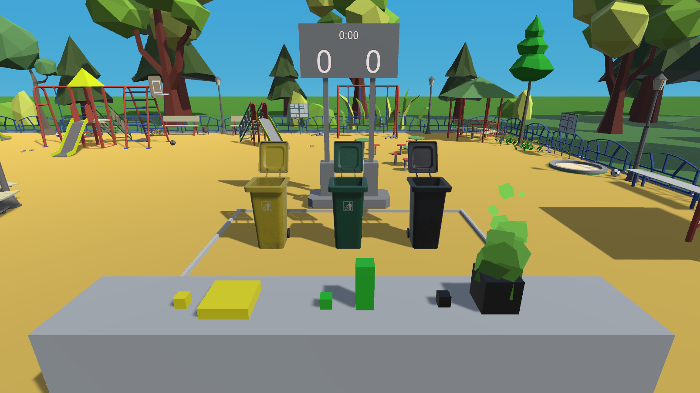
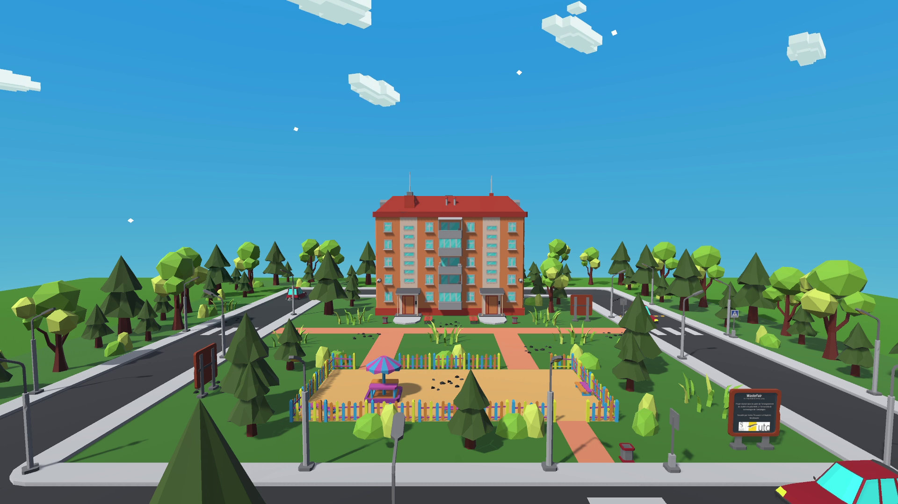
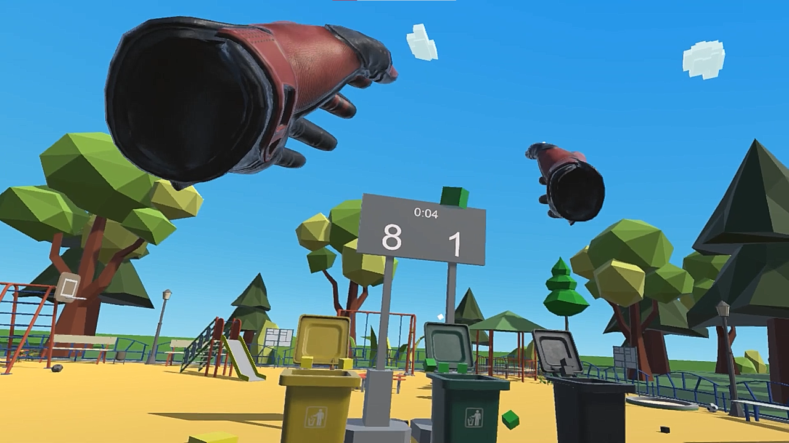

## The project 🚀
WasteFair is a project made as part of a virtual reality course. The goal was to make us discover VR and creation for VR. The major axis of the course is the interactions of the user in the virtual environment. We had a guideline for the game's theme : environment.

Knowing this we wondered how to make a pleasant, fun and interesting game while talking about the environment and ecology. Our idea was to propose a hub where we could place minigames. We know it, our battle for Earth spreads on several fronts. That was our ambition to create as much minigames as fronts we could identify. We directly wanted to do a multiplayer game because it allows to make a simple concept cool and fun with others.

To embody the hub we thought of a funfair where attractions and stands would be replaced by minigames.

At the end of the development, we managed to implement one minigame, the BasletWaste which is a waste sorting game with three waste colours to throw in the corresponding bin. We created a rich environment with nature, car engines, bees and play area sounds, a skybox with moving clouds and other players' representation all that to serve immersion.

## What I learned 🌟
- Using unity with SteamVR to develop a VR application
- Collaboration with Unity Collaborate
- It reinforced my knowledge about Mirror (especially authority and synchronisation wise)

## Gallery 🖼️
|||
:-------------------------:|:-------------------------:
|The BasketWaste area|The town welcoming the fair|

|||
:-------------------------:|:-------------------------:
|The MVP point of view !|Hello my friend !|

## video 🎥
Here is a link to the presentation video we made to promote the game 

Another link to a report made by our School about the project

